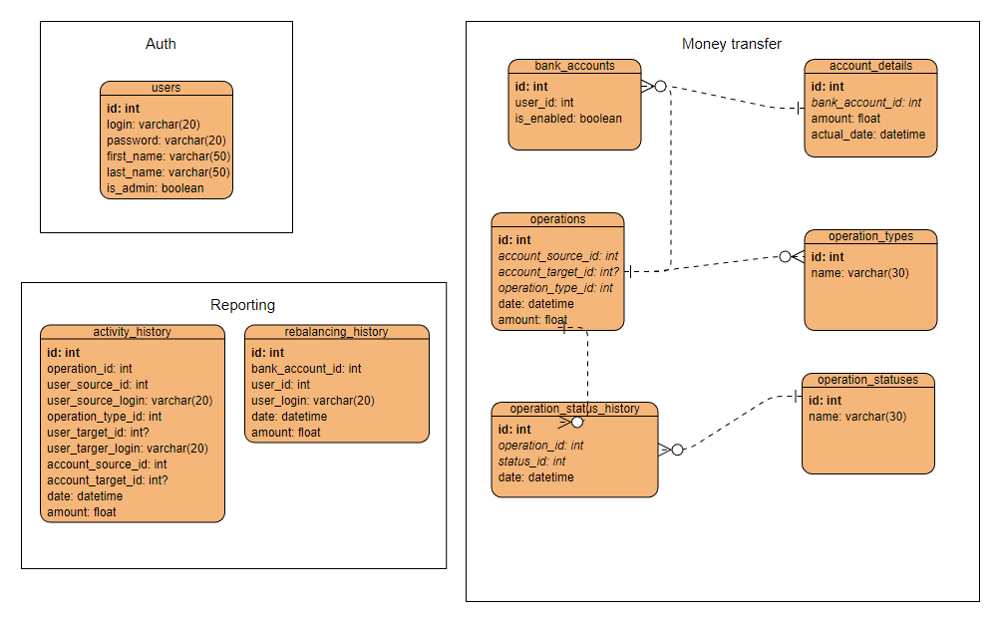

## Высоконагруженная система для денежных переводов

### Система состоит из следующих микросервисов:
1) сервис авторизации;
2) сервис денежных переводов;
3) сервис отчетности.

### Список технологий:
* Java 11 (lts version)
* Maven/Gradle
* Spring boot (core, data, jpa, security, web)
* Hibernate, JDBC
* PostgreSQL + H2 (для unit/integration tests)
* Liquibase db migration
* Kafka & Kafka Connect & Debezium & Confluent
* Swagger (api description)
* JUnit 5
* Nginx
* CI/CD (powershell)
* Docker

### Система имеет следующие фичи:
1) регистрация и авторизация пользователей;
2) пополнение кошельков пользователей;
3) перевод средств между пользователями;
4) построение отчетности.

### Особенности реализации:
* oauth2 протокол авторизации, выдача JWT-токенов;
* возможность запуска/остановки экземпляров сервиса, маршрутизация трафика (nginx round robin);
* первоначальное наполнение БД за счет скриптов инициализации;
* накат скриптов миграций БД с помощью Liquibase;
* использование mq (Kafka Connect) для синхронизации данных между микросервисами;
* документация Api Swagger;
* Тесты junit, integration;
* pipeline для тестирования, сборки и публикации приложения (локально, тестовый стенд, docker);
* учет горизонтального масштабирования для обеспечения отказоустойчивости;
* каждый экземпляр сервиса работает со своим экземпляром БД;
* возможность аудита данных: ведения истории изменений;
* реализация очереди сообщений всех переводов пользователей в сервис отчетности;
* сервис отчетности должен строить отчеты по переводам пользователей за период и изменению баланса.

### Разработанная архитектура микросервисов:

Рисунок 1 - Модель 3-х сервисов (аутентификации и авторизации Auth, банковских операций Money transfer и отчетности Reporting).

Далее описание назначения каждой таблицы.

#### **Сервис Auth:**
- *users* - хранит данные о всех пользователях системы. В колонке password будет содержаться хэш-пароля. По признаку role строится необходимая и достаточная ролевая модель.

#### **Сервис Money transfer:**
- *operation_types* - справочная таблица, содержащая типы операций ("Пополнение", "Вывод средств", "Перевод пользователю");
- *operation_statuses* - справочная таблица, содержащая возможные статусы операций ("Операция создана", "В процессе", "Списание осуществлено", "Принято", "Отменено");
- *bank_accounts* - таблица, которая хранит инфу о банковских счетах (у одного пользователя может быть несколько кошельков). Признак is_enabled - счет заморожен или неактивен (санкции ><);
- *account_details* - таблица, хранящая срез на определенную дату кол-ва средств на счете. Добавляется новая запись после каждой операции. Также таблица необходима для контроля возможности списания средств;
- *operations* - таблица, собирающая инфу обо всех проводимых операциях. Вот здесь в качестве amount содержится "дельта" операции (а не сумма на счете). Поле account_target_id может быть null , т.к. пользователь может пополнить свой собственный кошелек;
- *operation_status_history* - необходимая таблица, для отслеживания "жизненного пути" операции по банковскому "пайплайну".

#### **Сервис Reporting:**
- *activity_history* - необходима для отображения истории по операциям (учтены разные срезы - банковский счет отправителя, банковский счет получателя, логины, типы операций)
- *rebalancing_history* - таблица для хранения истории по изменению баланса.

Все таблицы сервиса __Money transfer__ переносятся в БД сервиса __Reporting__ посредством Kafka Connect, после чего шедуллер строит витринные данные по совершенным операциям и истории изменения баланса.

### Технологический стек каждого сервиса в отдельности

**Общий стек всех сервисов:**

java 11, Spring Framework, Spring Bean, Spring Cache, Spring Web, Spring Data, Springfox, jUnit, Mockito, Liquibase (xml-конфигурация), Postgresql, H2 (для тестов), sonarqube, docker

**Дополнения для каждого сервиса в стеках:**

1) *сервис авторизации (Auth)* - Gradle, jdbc
2) *сервис банковских переводов (Money transfer)* - Gradle, Hibernate
3) *сервис отчетности (Reporting)* - Maven, jdbc / Hibernate

### Межсервисное взаимодействие

Все сервисы взаимодействуют через Kafka по шине. Виды взаимодействия описаны ниже:

1) создание и валидация операций (взаимодействие экземпляров сервисов для отказоустойчивости);
2) создание банковского счета;
3) получение сообщений для сервиса отчетности, который коннекторами забирает и строит данные по таблицам "activity_history" и "rebalancing_history".

Допустима ситуация получения справочных данных из другого сервиса по REST (например, информации пользователя по его id). При этом такие данные кэшируются для недопущения излишней нагрузки на сервис.