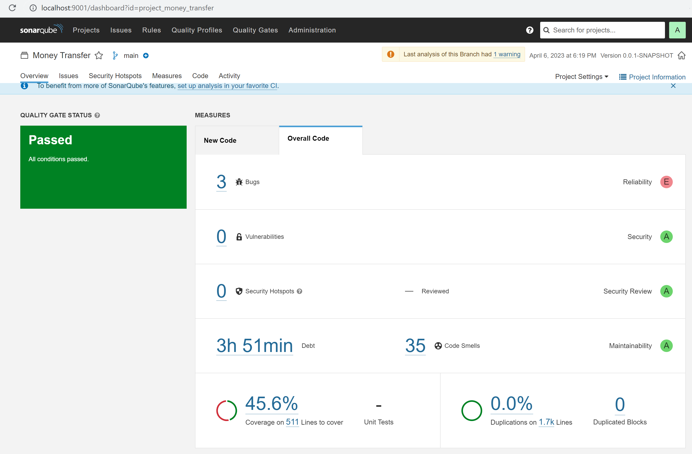

## Высоконагруженная система для денежных переводов

### Система состоит из следующих микросервисов:
1) сервис авторизации;
2) сервис денежных переводов;
3) сервис отчетности.

### Список технологий:
* Java 11 (lts version)
* Maven/Gradle
* Spring boot (core, cache, data jpa, security, web)
* Hibernate, JDBC
* PostgreSQL + H2 (для unit/integration tests)
* Liquibase db migration
* Kafka & Kafka Connect & Debezium & Confluent
* Swagger (api description)
* JUnit 5
* Nginx
* CI/CD (powershell)
* Docker
* Sonarqube, jacoco

### Система имеет следующие фичи:
1) регистрация и авторизация пользователей;
2) пополнение кошельков пользователей;
3) перевод средств между пользователями;
4) построение отчетности.

### Особенности реализации:
* oauth2 протокол авторизации, выдача JWT-токенов;
* возможность запуска/остановки экземпляров сервиса, маршрутизация трафика (nginx round robin);
* первоначальное наполнение БД за счет скриптов инициализации;
* накат скриптов миграций БД с помощью Liquibase;
* использование mq (Kafka Connect) для синхронизации данных между микросервисами;
* документация Api Swagger;
* Тесты junit, integration;
* pipeline для тестирования, сборки и публикации приложения (локально, тестовый стенд, docker);
* учет горизонтального масштабирования для обеспечения отказоустойчивости;
* каждый экземпляр сервиса работает со своим экземпляром БД;
* возможность аудита данных: ведения истории изменений;
* реализация очереди сообщений всех переводов пользователей в сервис отчетности;
* сервис отчетности строит отчеты по переводам пользователей за период и изменению баланса.

### Разработанная архитектура микросервисов:

Рисунок 1 - Модель 3-х сервисов (аутентификации и авторизации Auth, банковских операций Money transfer и отчетности Reporting).

Далее описание назначения каждой таблицы.

#### **Сервис Auth:**
- *users* - хранит данные о всех пользователях системы. В колонке password содержится хэш-пароля. По признаку role строится необходимая и достаточная ролевая модель.

#### **Сервис Money transfer:**
- *operation_types* - справочная таблица, содержащая типы операций ("Пополнение", "Вывод средств", "Перевод пользователю");
- *operation_statuses* - справочная таблица, содержащая возможные статусы операций ("Операция создана", "В процессе", "Списание осуществлено", "Принято", "Отменено");
- *bank_accounts* - таблица, которая хранит инфу о банковских счетах (у одного пользователя может быть несколько кошельков). Признак is_enabled - счет заморожен или неактивен (санкции ><);
- *account_details* - таблица, хранящая срез на определенную дату кол-ва средств на счете. Добавляется новая запись после каждой операции. Также таблица необходима для контроля возможности списания средств;
- *operations* - таблица, собирающая инфу обо всех проводимых операциях. Вот здесь в качестве amount содержится "дельта" операции (а не сумма на счете). Поле account_target_id может быть null , т.к. пользователь может пополнить свой собственный кошелек;
- *operation_status_history* - необходимая таблица, для отслеживания "жизненного пути" операции по банковскому "пайплайну".

#### **Сервис Reporting:**
- *activity_history* - необходима для отображения истории по операциям (учтены разные срезы - банковский счет отправителя, банковский счет получателя, логины, типы операций)
- *rebalancing_history* - таблица для хранения истории по изменению баланса.

Все таблицы сервиса __Money transfer__ переносятся в БД сервиса __Reporting__ посредством Kafka Connect, после чего шедуллер строит витринные данные по совершенным операциям и истории изменения баланса.

### Технологический стек каждого сервиса в отдельности

**Общий стек всех сервисов:**

java 11, Spring Framework, Spring Bean, Spring Cache, Spring Web, Spring Data, Springfox, jUnit, Mockito, Liquibase (xml-конфигурация), Postgresql, H2 (для тестов), sonarqube, docker

**Дополнения для каждого сервиса в стеках:**

1) *сервис авторизации (Auth)* - Gradle, jdbc
2) *сервис банковских переводов (Money transfer)* - Gradle, Hibernate
3) *сервис отчетности (Reporting)* - Maven, jdbc / Hibernate

### Межсервисное взаимодействие

Все сервисы взаимодействуют через Kafka по шине. Виды взаимодействия описаны ниже:

1) создание и валидация операций (взаимодействие экземпляров сервисов для отказоустойчивости);
2) создание банковского счета;
3) получение сообщений для сервиса отчетности, который коннекторами забирает и строит данные по таблицам "activity_history" и "rebalancing_history".

Допустима ситуация получения справочных данных из другого сервиса по REST (например, информации пользователя по его id). При этом такие данные кэшируются для недопущения излишней нагрузки на сервис.

### Запуск

Для билда и деплоя сервисов необходимо в командной строке запустить скрипт:
`./build_apps.ps1`. В результате выполнения данной команды будут скомпилены все проекты, выполнены тесты, запущены все необходимые контейнеры в Docker, а также установлены необходимые коннекторы для репликации БД.

После успешного деплоя сервисы будут доступны по следующим адресам:
* money_transfer - http://localhost:8080
* money_transfer (реплика) - http://localhost:8079
* reporting - http://localhost:8081
* auth - http://localhost:8082
* pg admin - http://localhost:5050
* kafdrop (просмотр очереди) - http://localhost:9000
* kafka connect - http://localhost:8083
* load balancer - http://localhost:9090

### Load balancer

В качестве демонстрации работы балансировщика нагрузки был создан контейнер _load_balancer_, который перенаправляет запросы по round robin между основным и репликой-контейнерами приложения _money_transfer_. Для этих целей разработан скрипт `./test_balancer.ps1`, запрашивающий уникальный ключ контейнера 30 раз.

### Sonarqube

Для оценки качества кода приложения _money_transfer_ и покрытия бизнес-логики приложения тестами, необходимо запустить экземпляр контейнера Sonarqube. 
Это можно сделать следующим образом:
1) для директории sonarqube выполнить `docker-compose up -d --build` в терминале;
2) после команды выше будет доступен контейнер sonarqube по адресу: http://localhost:9001
3) далее необходимо авторизоваться по ссылке выше по дефолтным учетным данным `admin / admin` ;
4) система предложить поменять пароль по-умолчанию. Измените его на `admin1`, например;
5) теперь следует сгенерировать аутентификационный токен, с помощью которого можно будет запускать анализ проекта. 
Необходимо перейти в настройки аккаунта -> раздел безопасность и сгенерировать глобальный токен.
6) полученный в предыдущем пункте токен вписать в скрипт `build.gradle`, в значение параметра `sonarqube->properties->sonar.login`;
7) в директории проекта _money_transfer_ выполнить скрипт `analyze_sonarqube.ps1` (или команды из скрипта в отдельности самостоятельно);
8) должен получиться результат ниже:
   

Рисунок 2 - результат обработки измерения качества программного кода.

Вместе с плагином jacoco можно отследить уровень покрытия программного кода тестами (параметр _Coverage_ на рисунке 2).